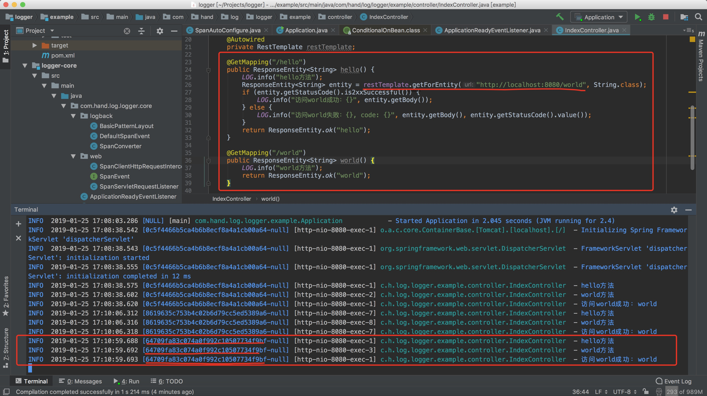

# logger

> 基于spring boot的日志跟踪组件

## 背景

大多数时候，根据日志我们完全不知道一个请求执行的情况。因此，根据分布式链路跟踪的思想，我创建了一个span，一直随着请求传递下去。放入ThreadLocal，logback打印出来。

## 展示

例如：

上面访问`/hello`，但是`/hello`又通过restTemplate访问了`/world`，我们通过拦截器将span传递，这样日志中就是同一个spanId。

## 使用

[example](./example)

## span支持

暂时只支持restTemplate、feign传递span。

* `logger-core`: restTemplate拦截器，logback异步打印日志支持
* `logger-thrift/logger-thrift-feign`: feign拦截器

当然，原理就是在拦截器中添加span header头信息，简单扩展下就能支持zuul、spring gateway。

## 说明

本项目只是一个**残次品**，是分布式链路跟踪在日志打印方面的一种思路实现。对本项目有兴趣的道友，欢迎去自定义。